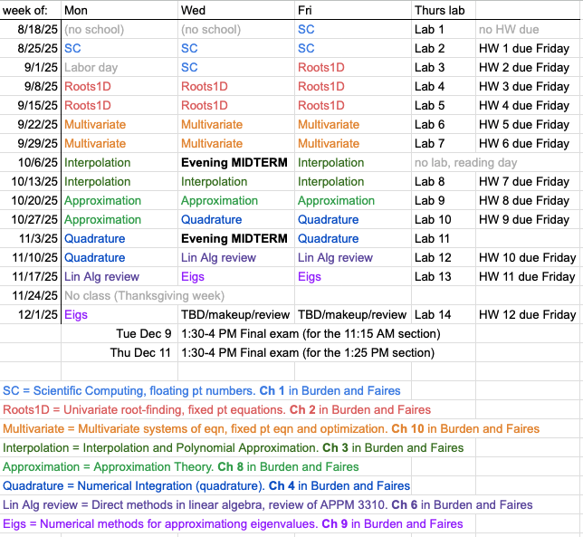

# Day by day schedule for APPM 4600 Numerical Methods and Scientific Computing

Fall 2025, Instructor: Stephen Becker (Applied Math dept)

# High-level list of topics
Here's the tentative plan for Fall 2025. Note that we may change things slightly, so see the "Detailed list" below for what w actually cover.

# Detailed list of topics
i.e., what we actually covered.  Topics listed for dates in the future are just estimates,  and will be revised later.

References are to Burden and Faires, 10th edition, unless otherwise noted

#### Week 1, Chapter 1 (preliminaries, floating pt numbers)

- Thurs, Aug 21, [Lab 1](Labs/Lab01_IntroPython.ipynb)
  - Setup Python locally and on cloud
- Fri, Aug 22 
  - [Calc Review](Notes/Ch1_CalcReview.pdf) and [Floating Point Numbers](Notes/Ch1_FloatingPoint.pdf). 
  - Refs: ch 1.1 and 1.2 and other sources. 
  - Demos: [sCh1_SymbolicTaylorSeries](Demos/Ch1_SymbolicTaylorSeries.ipynb)  

#### Week 2, Chapter 1 (floating pt numbers, scientific computing)

- Mon, Aug 25
  - [Conditioning](Notes/Ch1_ConditionNumber.pdf) and [Stability](Notes/Ch1_Stability.pdf) and [Big-O notation](Notes/Ch1_BigO_notation.pdf). 
  - Refs: mostly from Driscoll and Braun, some ch 1.3. 
  - Demos: [Ch1_DataTypes](Demos/Ch1_DataTypes.ipynb) and [Ch1_ExponentialSummation](Demos/Ch1_ExponentialSummation.ipynb)
- Wed, Aug 27
  - [Polynomials and Horner's Rule](Notes/Ch1_PolynomiallConditioning_HornersRule.pdf), partly from Driscoll and Braun; and [Rates of convergence](Notes/Ch1_ConvergenceRates.pdf), from ch 2.4. 
  - Demos: [Ch1_Stability_simple](Demos/Ch1_Stability_simple.ipynb) demo (evaluating a quadratic, and relative error) and [Ch1_QuadraticFormula](Demos/Ch1_QuadraticFormula.ipynb) demo (quadratic root finding). 
  - Optional: [Ch1_Extra_Conditioning](Demos/Ch1_Extra_Conditioning.ipynb) is a summary of ch 1 material from Jed Brown's course; and extra demo on [Ch1_RatesOfConvergence](Demos/Ch1_RatesOfConvergence.ipynb)
- Thurs, Aug 28, Lab 2
  - Scientific workflow, git, debugging...
- Fri, Aug 29
  - TBD, ch 1 stuff

#### Week 3, Chapter 2 (1D root-finding)

- Mon, Sep 1.  No class (labor day)
- Wed, Sep 3 
  - Automatic Differentiation
- Thu, Sep 4, Lab 3
  - TBD (Auto Diff?)
- Fri, Sep 5 
  - [Intro to scalar root-finding](Notes/Ch2_IntroRootfinding.pdf), [Intro to scalar optimization](Notes/Ch2_IntroOptimization.pdf), [Condition number of root-finding](Notes/Ch2_AnalysisRootFindingConditionNumber.pdf), [multiple roots](Notes/Ch2_MultipleRoots.pdf)
  - Refs: some from misc sources or Driscoll and Braun

#### Week 4, more Chapter 2 (1D root-finding)

- Mon, Sep 8 
  - [Bisection Method](Notes/Ch2_BisectionMainIdea.pdf), from ch 2.1
  - Demo: [Ch2_Intersection_GraphingCalculator.ipynb](Demos/Ch2_Intersection_GraphingCalculator.ipynb)
- Wed, Sep 10 
  - [Fixed Point Iteration](Notes/Ch2_FixedPointIteration.pdf), from ch 2.2
  - Demo: [Ch2_IntroToBisection.ipynb](Demos/Ch2_IntroToBisection.ipynb)
  - Demo: [HowToCheckYourAnswerUsingExtendedPrecision.ipynb](Demos/HowToCheckYourAnswerUsingExtendedPrecision.ipynb) or [HowToCheckYourAnswerUsingExtendedPrecision.m](Demos/HowToCheckYourAnswerUsingExtendedPrecision.m) (Matlab)
- Thu, Sep 11, Lab 4
  - TBD, probably root-finding
- Fri, Sep 12 
  - [Newton's Method](Notes/Ch2_NewtonsMethod.pdf), from ch 2.3
  - Demo: [Ch2_FixedPointPlots.ipynb](Demos/Ch2_FixedPointPlots.ipynb)  which uses a nice [geogebra online cobweb plotting app](https://www.geogebra.org/m/uvsfvNDt)

#### Week 5, more Chapter 2 (1D root-finding)
- Mon, Sep 15 
  - [Newton's Method Variants (secant method, etc.)](Notes/Ch2_NewtonsMethodVariants.pdf)
  - Demo: [Ch2_NewtonsMethod.ipynb](Demos/Ch2_NewtonsMethod.ipynb)
- Wed, Sep 17 
  - [Aitken Extrapolation](Notes/Ch2_AitkenExtrapolation.pdf) and [Zeros of Polynomials and Muller's Method](Notes/Ch2_ZerosPolynomialMullers.pdf), from ch 2.5 and 2.6
    - Demo: [Ch2_AitkenExtrapolation.ipynb](Demos/Ch2_AitkenExtrapolation.ipynb)
  - or... me might skip some of those topics (TBD)
- Thu, Sep 18, Lab 5
  - TBD, probably root-finding, and/or exploring convergence rates
- Fri, Sep 19 
  - TBD
#### Week 6, Chapter 10 (nonlinear systems of equations)
- Mon, Sep 22 
  - Ch 10.1, multivariate fixed pt equations
- Wed, Sep 24 
  - Ch 10.2, Newton's method for systems
- Thu, Sep 25, Lab 6
  - TBD, probably multivariate systems of equations
- Fri, Sep 26 
  - Ch 10.2
#### Week 7, Chapter 10 (nonlinear systems of equations)
- Mon, Sep 29 
  - Ch 10.3, Quasi-Newton methods
- Wed, Oct 1 
  - Ch 10.3, Quasi-Newton methods
- Thu, Oct 2, Lab 7
  - TBD, probably optimization, local vs global minimizers, or compare 0th vs 1st vs 2nd order methods
- Fri, Oct 3 
  - Ch 10.4, Steepest-descent (aka Gradient-descent)
#### Week 8, Chapter 3 (interpolation)
- Mon, Oct 6 
  - [Intro to Interpolation](Notes/Ch3_IntroInterpolation.pdf) and [Lagrange interpolation](Notes/Ch3_LagrangeAndBarycentricInterpolation.pdf), from ch 3.1
- Wed, Oct 8 
  - In-class review
  - Evening **midterm exam**
- Thu, Oct 9 (no lab, reading day)
- Fri, Oct 10 
  - "Barycentric Interpolation formula" [same notes as before](Notes/Ch3_LagrangeAndBarycentricInterpolation.pdf) from Driscoll and Braun;
    - cf. [Berrut and Trefethen's 2004 SIAM Review article](https://people.maths.ox.ac.uk/trefethen/barycentric.pdf); 
  - "Lagrange Interpolation Error Bounds" (10 min video; [same notes as before](Notes/Ch3_LagrangeAndBarycentricInterpolation.pdf)) ch 3.2; 
  - [Divided Differences](Notes/Ch3_DividedDifferences.pdf) from ch 3.3
  - Demos: [Ch3_PolynomialInterpolation.ipynb](Demos/Ch3_PolynomialInterpolation.ipynb), which also links to other demos
  - Further resources on Lagrange interpolation:
    - [8 min youtube video](https://www.youtube.com/watch?v=_zK_KhHW6og) (nice handwriting)
    - [42 min youtube video](https://www.youtube.com/watch?v=M8hF7QChkSY) (with Vandermonde matrix and divided differences) -- this is a standard classroom blackboard lecture from Wen Shen at Penn State (textbook author, nice handwriting)
    - [13 min youtube video](https://www.youtube.com/watch?v=C1Jijw3VaI0)
#### Week 9, more Chapter 3 (interpolation)
- Mon, Oct 13 
  - Finish up anything from Friday
  - [Hermite Interpolation](Notes/Ch3_Hermite.pdf) from ch 3.4
- Wed, Oct 15 
  - [Splines](Notes/Ch3_Splines.pdf) from ch 3.5 (we'll skip ch 3.6)
  - Demo: [splines](Demos/Ch3_Splines.ipynb)
- Thu, Oct 16, Lab 8
  - TBD, probably interpolation
- Fri, Oct 17 
  - TBD (more interpolation)
#### Week 10, Chapter 8 (approximation theory)
- Mon, Oct 20 
  - Ch 10.1, discrete l2
- Wed, Oct 22 
  - Ch 10.2-10.3, continuous L2
- Thu, Oct 23, Lab 9
  - TBD, probably splines, or something with [chebfun](https://www.chebfun.org/)
- Fri, Oct 24 
  - 10.4, Rational function approximation
  - [The first five years of the AAA algorithm](https://people.maths.ox.ac.uk/trefethen/nak_sete_tref_revised.pdf) by Y. Nakatsukasa, O. Sete, L. N. Trefethen
#### Week 11, Chapter 4 (numerical integration)
- Mon, Oct 27 
  - 10.5, Trigonometric polynomial approximation
- Wed, Oct 29 
  - [Intro to quadrature](Notes/Ch4_quadrature_intro.pdf), and [Newton Cotes formula](Notes/Ch4_quadrature_NewtonCotes.pdf) from ch 4.3
  - Demo: [Ch4_integration.ipynb](https://github.com/stephenbeckr/numerical-analysis-class/blob/master/Demos/Ch4_integration.ipynb)
  - Demo: [Misc_speedExamples.ipynb](Demos/Misc_speedExamples.ipynb) 
  - Note: We will not cover the first parts of this chapter (on *differentiation*), as that is now covered 2nd semester along with Ch 5.  For reference, we have some old notes: [Intro to numerical differentiation](Notes/Ch4_FiniteDifferencesIntro.pdf) and [Finite differences](Notes/Ch4_FiniteDifferences_more.pdf) on ch 4.1; with a [finite differences demo](Demos/Ch4_FiniteDifferences.ipynb); and [Richardson extrapolation](Notes/Ch4_RichardsonExtrapolation.pdf) on ch 4.2 along with the [Ch4_RichardsonExtrapolation.ipynb demo](Demos/Ch4_RichardsonExtrapolation.ipynb)
- Thu, Oct 30, Lab 10
  - TBD, perhaps simple quadrature (using numpy's builtin tools), compared to symbolic (sympy/mathematica), compared to [chebfun](https://www.chebfun.org/) which has the aim to "feel symbolic but run at the speed of numerics"
- Fri, Oct 31 
  - [Composite quadrature](Notes/Ch4_quadrature_composite.pdf) from ch 4.4
  - Demo: [Ch4_CompositeIntegration.ipynb](Demos/Ch4_CompositeIntegration.ipynb)
  - Note: we are *not* covering Gregory's method; if you're interested, see (CU professor) Bengt Fornberg's talk [Gregory formulas and improving on the Trapezoidal rule](https://www.colorado.edu/amath/sites/default/files/attached-files/2019_unm_0.pdf)

#### Week 12, more Chapter 4 (numerical integration)

- Mon, Nov 3 
  - [Romberg integration](Notes/Ch4_RombergIntegrationEulerMacLaurin.pdf) from ch 4.5
    - Demo: [Ch4_RombergIntegration.ipynb](Demos/Ch4_RombergIntegration.ipynb)
  - We'll skip Romberg if we're short on time
- Wed, Nov 5 
  - In-class review
  - Evening **midterm exam**
- Thu, Nov 6, Lab 11
  - TBD, maybe on adaptive integration
- Fri, Nov 7 
  - [Adaptive integration](Notes/Ch4_AdaptiveIntegration.pdf) from ch 4.6
    -  Demo: [Ch4_AdaptiveIntegration.ipynb](Demos/Ch4_AdaptiveIntegration.ipynb)
#### Week 13, Chapter 6 (direct methods for linear algebra)
- Mon, Nov 10 
  - [Gaussian quadrature](Notes/Ch4_GaussianQuadrature.pdf) from ch 4.7 and also from the Driscoll and Braun supplementary text
    - Demo: [Ch4_GaussianQuadrature.ipynb](Demos/Ch4_GaussianQuadrature.ipynb)
  - Further resources on Gaussian quadrature:
    - a 4 part youtube video series:
          1. [Preview](https://www.youtube.com/watch?v=k-yUdqRXijo)
          2. [Part 1: Legendre polynomials](https://www.youtube.com/watch?v=65zwMgGZnUs)
          3. [Part 2: Determining the weights](https://www.youtube.com/watch?v=nQZYBWB6q_k)
          4. [Part 3: Explanation](https://www.youtube.com/watch?v=cKKrGr93f6c)
    - Lloyd Trefethen, "[Is Gauss Quadrature Better than Clenshaw–Curtis?](http://citeseerx.ist.psu.edu/viewdoc/download?doi=10.1.1.157.4174&rep=rep1&type=pdf)"", SIAM Review 50(1), pp. 67–87 (2008)
    - Topics in our class: Gauss-Legendre, Gauss-Laguerre, Gauss-Hermite; *skip* Chebyshev-Gauss. Note that we are *not* covering Clenshaw-Curtis
  - Time-permitting, we may cover 
    - [Multiple Integrals](Notes/Ch4_MultipleIntegrals.pdf), from ch 4.8, with demo [Ch4_MultidimensionalIntegrals.ipynb](Demos/Ch4_MultidimensionalIntegrals.ipynb)
    - and/or [Improper Integrals](Notes/Ch4_ImproperIntegrals.pdf) from ch 4.9, with demo [Ch4_ImproperIntegrals.ipynb](Demos/Ch4_ImproperIntegrals.ipynb)
- Wed, Nov 12 
  - [Complexity of Matrix Multiplication](Notes/Ch6_ComplexityMatrixMultiplication.pdf) and [Systems of Linear Equations and Gaussian Elimination](Notes/Ch6_SystemsOfEquations_GaussianElimination.pdf); we discuss some BLAS
  - Demo: [Ch6_MatrixMultiplication.ipynb](Demos/Ch6_MatrixMultiplication.ipynb), talk about BLAS and LAPACK
  - In chapter 6, we're roughly covering the material from the book, but adding more (conditioning, more details on LAPACK/BLAS), and doing it in a different order; we're also moving fast, since APPM 3310 "Matrix Methods" is a prereq for this class and these topics were covered in that class
- Thu, Nov 13, Lab 12
  - TBD
- Fri, Nov 14 
  - [LU factorization](Notes/Ch6_LUfactorization.pdf)
#### Week 14, Chapter 9 (Eigenvalues)
- Mon, Nov 17 
  - [LU factorization details: pivoting, and block factorization, and special types of matrices](Notes/Ch6_LU_details_pivoting_Cholesky.pdf)
  - Demo: [Ch6_LU_vs_Cholesky.ipynb](Demos/Ch6_LU_vs_Cholesky.ipynb) (short)
  - Time-permitting, we may cover:
    - [Conditioning of solving linear systems](Notes/Ch6_ConditioningOfLinearSystems.pdf) and [Least Squares](Notes/Ch6_LeastSquares.pdf)
    - Demo: [Ch6_conditioning_LeastSquares.ipynb](Demos/Ch6_conditioning_LeastSquares.ipynb) (long) and [Ch6_RepeatedSolves.ipynb](Demos/Ch6_RepeatedSolves.ipynb) (short)
    - Optional: take my [Least squares challenge](https://github.com/stephenbeckr/ML-theory-class/blob/main/Code/LeastSquaresChallenge.ipynb) (solutions available on the [solutions branch](https://github.com/stephenbeckr/ML-theory-class/blob/solutions/Code/LeastSquaresChallenge_soln.ipynb)). Can you solve a least-squares problem as fast or as accurately as LAPACK?
- Wed, Nov 19
  - More ch 6, or ch 9. QR factorization
- Thu, Nov 20, Lab 13
  - TBD
- Fri, Nov 21 
  - Ch 9.5, QR iteration for eigenvalues
#### Thanksgiving break, no class

#### Week 15, iterative methods (Ch 9, possibly Ch 7)
- Mon, Dec 1 
  - Ch 9.3, Power method
- Wed, Dec 3 
  - Time-permitting, we may cover Ch 7.6 Conjugate Gradient method
- Thu, Dec 4, Lab 14
  - TBD
- Fri, Dec 5 
  - TBD / makeup / review session

#### Final exams
- Tue, Dec 9 
  - 1:30-4 PM Final exam (for the 11:15 AM section)
- Thu, Dec 11 
  - 1:30-4 PM Final exam (for the 1:25 PM section)